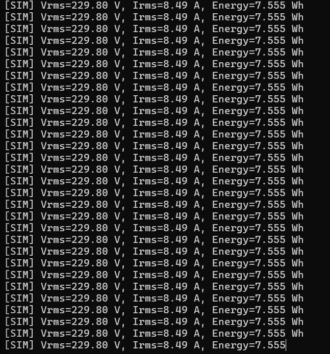
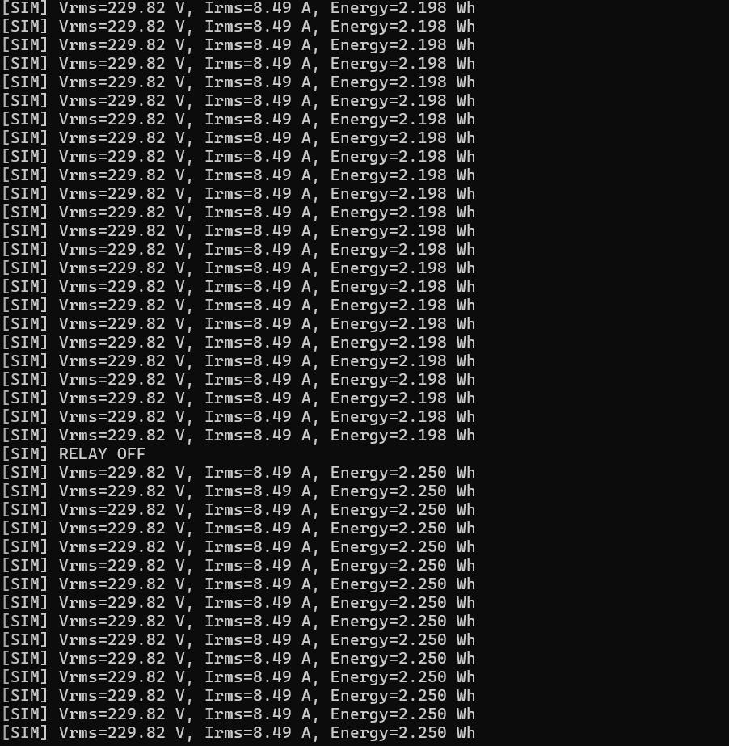

⚡ Smart Energy Monitor Firmware (Simulation-Based)

A simulation-first embedded firmware for RMS-based energy monitoring and overload protection with latched fault handling

🔍 Overview:

This project implements a smart energy monitoring and protection firmware using a simulation-driven embedded architecture.
It measures RMS voltage and current, computes real power and energy, detects overload conditions, and safely trips a relay using a latched fault manager, all without physical hardware.

The firmware is structured exactly like a real embedded system and can later be deployed on actual microcontroller hardware with minimal changes.

✨ Key Features:

✅ RMS voltage & current computation (windowed sampling)

✅ Real power & energy (Wh) calculation

✅ Overload detection using RMS thresholds

✅ Latched relay trip via fault manager

✅ Simulation-based ADC, timer, GPIO, and communication layers

✅ Continuous telemetry even after fault (fail-safe design)

✅ Clean HAL / APP separation (production-style firmware)

🏗️ Firmware Architecture:

┌────────────────────────────┐
│        main.c              │
│  (System Orchestration)    │
└────────────┬───────────────┘
             │
             ▼
┌────────────────────────────┐
│     Energy Manager          │
│  - RMS Voltage             │
│  - RMS Current             │
│  - Real Power              │
│  - Energy (Wh)             │
└────────────┬───────────────┘
             │  RMS Ready
             ▼
┌────────────────────────────┐
│    Load Controller          │
│  - Overload Detection      │
│  - Multi-cycle Validation  │
└────────────┬───────────────┘
             │  Fault Trigger
             ▼
┌────────────────────────────┐
│    Fault Manager            │
│  - Latched Fault State     │
│  - Safety Authority        │
└────────────┬───────────────┘
             │
             ▼
┌────────────────────────────┐
│      GPIO / Relay           │
│  - Forced OFF on fault     │
└────────────────────────────┘

📁 Project Structure:

smart-energy-monitor-firmware/
├── firmware/
│   ├── app/        # Core logic (hardware-independent)
│   ├── hal/        # Hardware abstraction layer
│   ├── sim/        # Simulation models
│   ├── include/    # Public headers
│   └── main.c
├── docs/
│   ├── architecture.md
│   └── simulation_model.md
├── assets/
│   └── screenshots/
│       ├── sim_normal_operation.png
│       ├── sim_overload_detected.png
│       └── sim_relay_tripped.png
└── README.md

🔄 Simulation Flow (Animated Explanation):
ADC (Simulated Sine Wave)
        │
        ▼
Voltage / Current Samples
        │
        ▼
RMS Window (100 samples)
        │
        ▼
RMS Ready Flag ───────▶ Protection Logic
                            │
                            ▼
                   Overload Detected?
                      │        │
                     NO       YES
                      │        ▼
                      │   Fault Manager
                      │        │
                      └──────▶ Relay OFF

Simulation Output Examples:

✅ Normal Operation
[SIM] Vrms=229.82 V, Irms=7.05 A, Energy=1.71 Wh

⚠️ Overload Condition
[SIM] Vrms=229.82 V, Irms=8.49 A, Energy=2.19 Wh

❌ Protection Triggered
[SIM] RELAY OFF

## Simulation Output

### Normal Operation

### Overload Detection & Protection

How to Build & Run (Windows + MSYS2):

gcc -DSIMULATION \
firmware/main.c \
firmware/app/*.c \
firmware/hal/*.c \
firmware/sim/*.c \
-o sim_energy_monitor -lm

Run:

./sim_energy_monitor

📜 License

This project is for educational and demonstration purposes.